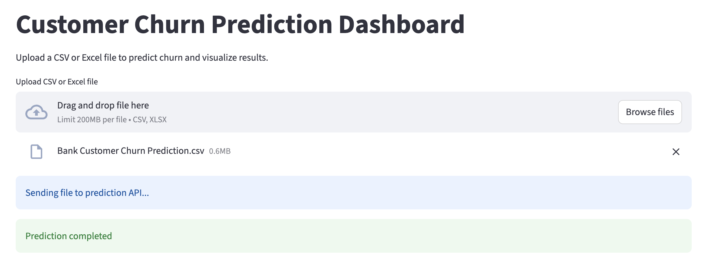
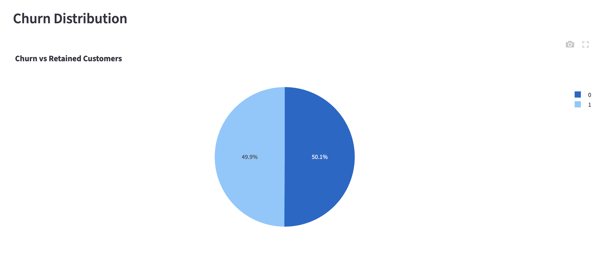
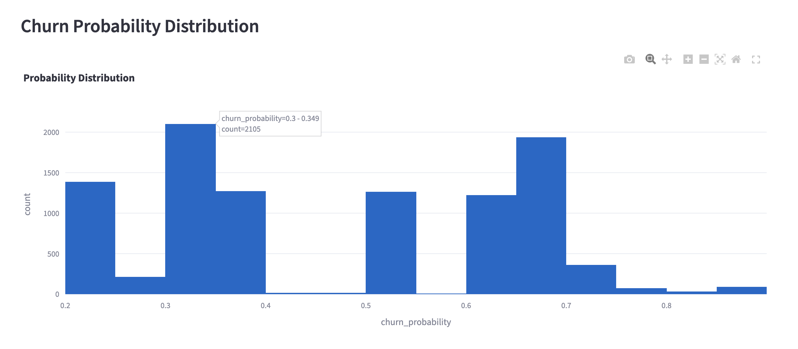
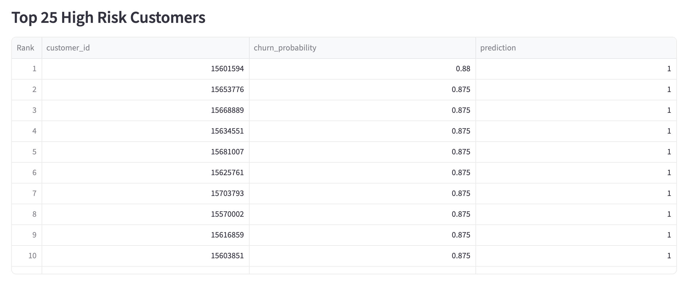
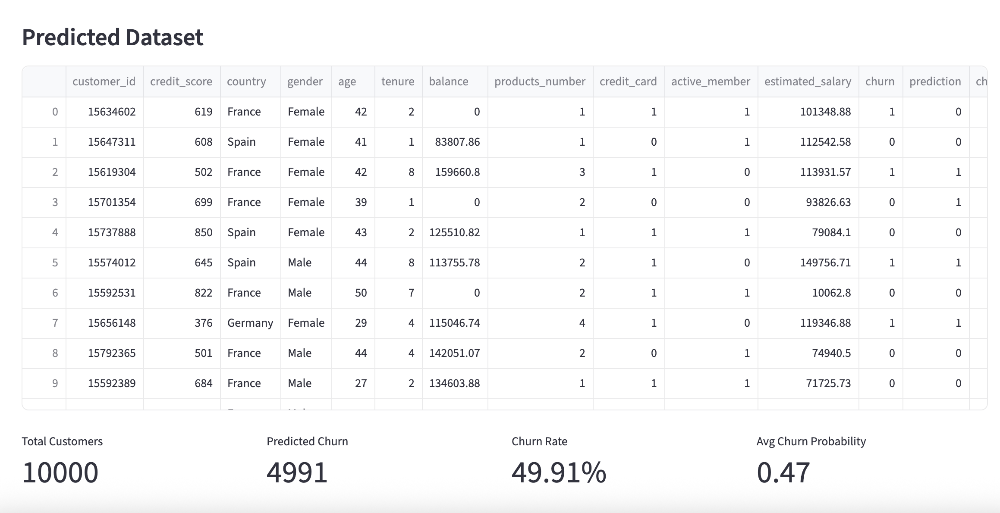

# Customer Churn Prediction System

An end-to-end **Machine Learning platform** that predicts customer churn using automated data preprocessing, feature selection, model comparison, and an interactive analytics dashboard.

The system accepts **CSV or Excel datasets with flexible column names**, automatically preprocesses the data, compares multiple machine learning models, selects the best performing model, and generates churn predictions with visual insights.

The platform includes:

• Machine Learning training pipeline
• FastAPI prediction service
• Interactive Streamlit dashboard
• Dynamic churn analytics
• Dockerized deployment

---

# Project Overview

Customer churn prediction helps businesses identify customers who are likely to leave their service. By predicting churn in advance, companies can take proactive actions to retain valuable customers.

This project builds a **complete churn prediction pipeline** that:

• Accepts datasets in **CSV / Excel format**
• Automatically **matches flexible column names**
• Handles **missing values**
• Performs **data preprocessing**
• Trains and compares **multiple ML models**
• Automatically **selects the best performing model**
• Extracts **top important features**
• Generates **churn predictions**
• Displays **dynamic dashboards**
• Allows **downloading prediction results**
• Supports **Docker deployment**

---

# Key Features

• Automatic dataset ingestion (CSV / Excel)
• Intelligent column matching for flexible datasets
• Missing column handling
• Automated preprocessing pipeline
• Multi-model training and evaluation
• Automatic best model selection
• Feature importance extraction
• REST API for predictions
• Interactive churn analytics dashboard
• Top 25 high-risk customers detection
• Download predicted datasets
• Fully Dockerized application

---

# Machine Learning Models Compared

The system trains multiple machine learning models and automatically selects the best performing one.

Models evaluated:

• Logistic Regression
• Random Forest Classifier
• Gradient Boosting Classifier
• XGBoost
• LightGBM

### Model Performance Comparison

| Model               | Accuracy  | Precision | Recall    | F1 Score  |
| ------------------- | --------- | --------- | --------- | --------- |
| Logistic Regression | 0.811     | 0.552     | 0.201     | 0.295     |
| Random Forest       | **0.970** | **0.937** | **0.813** | **0.876** |
| Gradient Boosting   | 0.875     | 0.777     | 0.506     | 0.613     |
| XGBoost             | 0.938     | 0.935     | 0.733     | 0.822     |
| LightGBM            | 0.904     | 0.853     | 0.621     | 0.719     |

**Best Performing Model:** Random Forest

The system automatically selects the best model and saves it for production predictions.

Primary ML library used:

• scikit-learn

---

# System Architecture

```
Dataset (CSV / Excel)
        │
        ▼
Column Matching Engine
        │
        ▼
Data Preprocessing
        │
        ▼
Feature Selection
        │
        ▼
Model Training (5 Models)
        │
        ▼
Model Evaluation
        │
        ▼
Best Model Selection
        │
        ▼
FastAPI Prediction API
        │
        ▼
Streamlit Dashboard
        │
        ▼
Dynamic Churn Analytics
```

---

# Project Structure

```
churn-prediction-system
│
├── api
│   ├── app.py
│   └── __init__.py
│
├── dashboard
│   └── dashboard.py
│
├── data
│   └── dataset
│
├── models
│   ├── best_model.pkl
│   ├── preprocessor.pkl
│   └── selected_features.pkl
│
├── outputs
│   ├── feature_importance.csv
│   ├── model_performance.csv
│   └── predictions.xlsx
│
├── src
│   ├── data_loader.py
│   ├── evaluate.py
│   ├── feature_selection.py
│   ├── model_training.py
│   └── preprocessing.py
│
├── utils
│   └── column_mapper.py
│
├── Dockerfile
├── docker-compose.yml
├── train.py
├── requirements.txt
└── README.md
```

---

# Installation

Clone the repository

```
git clone https://github.com/PriyangaCB/churn-prediction-system.git
```

Navigate to the project folder

```
cd churn-prediction-system
```

Create virtual environment

```
python -m venv venv
```

Activate environment

Mac / Linux

```
source venv/bin/activate
```

Windows

```
venv\Scripts\activate
```

Install dependencies

```
pip install -r requirements.txt
```

---

# Training the Model

Run the training pipeline:

```
python train.py
```

This will:

• preprocess the dataset
• train multiple ML models
• evaluate performance
• select the best model
• extract important features
• save the trained model

Saved artifacts:

```
models/best_model.pkl
models/preprocessor.pkl
models/selected_features.pkl
```

---

# Running the API

Start the FastAPI server:

```
uvicorn api.app:app --reload
```

API will run at:

```
http://127.0.0.1:8000
```

Swagger documentation:

```
http://127.0.0.1:8000/docs
```

---

# Running the Dashboard

Start the Streamlit dashboard:

```
streamlit run dashboard/dashboard.py
```

Open the dashboard:

```
http://localhost:8501
```

Users can:

• Upload CSV or Excel files
• Generate churn predictions
• View dynamic churn analytics
• Identify top 25 high-risk customers
• Download predicted datasets

---

# Prediction Methods

The system supports two prediction approaches.

### 1. File Upload Prediction

Upload a CSV or Excel file containing customer data.

The system will:

• automatically match column names
• preprocess the dataset
• align required features
• generate churn predictions
• visualize churn insights

---

### 2. Manual Input Prediction

Users can send feature values directly to the API.

Example request:

```
{
  "credit_score": 650,
  "age": 45,
  "balance": 120000,
  "products_number": 2,
  "active_member": 1
}
```

The API returns:

• churn prediction
• churn probability
• customer risk result

---

# Dashboard Analytics

The interactive dashboard provides:

• Customer churn distribution
• Churn probability analysis
• Business churn metrics
• Top 25 high-risk customers
• Dynamic visual insights

Users can also **download prediction results as Excel files**.

---

# Docker Deployment

The application can be deployed using Docker.

Build the image:

```
docker build -t churn-prediction-system .
```

Run the container:

```
docker run -p 8000:8000 churn-prediction-system
```

API documentation:

```
http://localhost:8000/docs
```

---

## Dashboard Preview

### Churn Analytics Dashboard


### Churn Distribution


### Churn Probability Distribution


### Top High Risk Customers


### Prediction Results


# Technologies Used

Python
pandas
numpy
scikit-learn
FastAPI
Uvicorn
Streamlit
Plotly
Docker

---

# Future Improvements

• Add model explainability using SHAP
• Deploy system to cloud platforms (AWS / Azure)
• Add authentication for API access
• Build automated retraining pipeline

---

# Author

Priyanga
